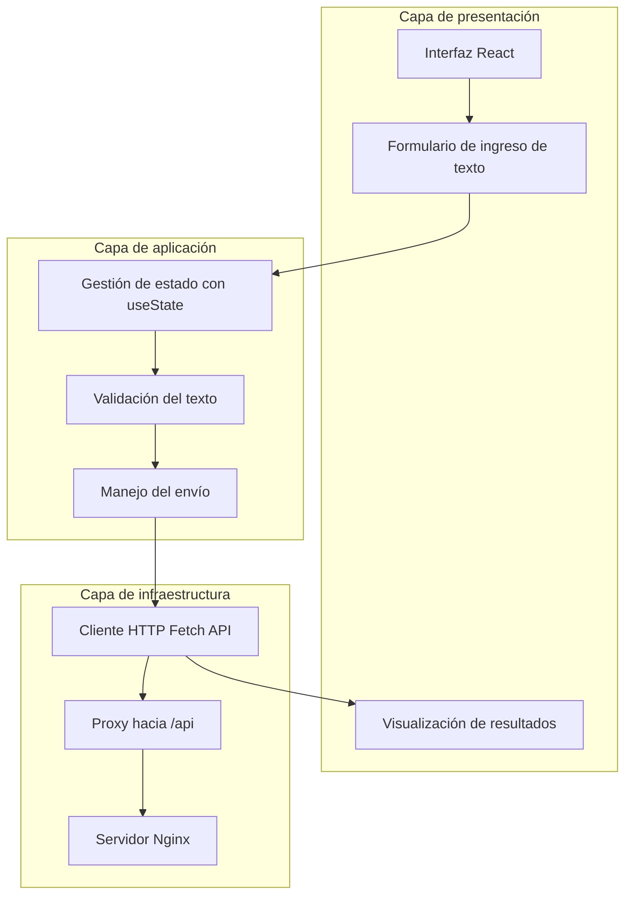

# Arquitectura interna del frontend

```mermaid
flowchart TB
    subgraph PRESENTACION["Capa de presentación"]
        UI[Interfaz React]
        FORM[Formulario de ingreso de texto]
        RESULT[Visualización de resultados]
    end

    subgraph APLICACION["Capa de aplicación"]
        STATE[Gestión de estado con useState]
        SUBMIT[Manejo del envío]
        VALIDATION[Validación del texto]
    end

    subgraph INFRAESTRUCTURA["Capa de infraestructura"]
        FETCH[Cliente HTTP Fetch API]
        NGINX[Servidor Nginx]
        PROXY[Proxy hacia /api]
    end

    UI --> FORM
    FORM --> STATE
    STATE --> VALIDATION
    VALIDATION --> SUBMIT
    SUBMIT --> FETCH
    FETCH --> PROXY
    PROXY --> NGINX
    FETCH --> RESULT
```