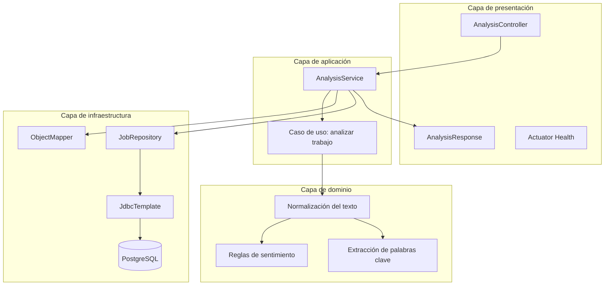

# Arquitectura interna del servicio Java

```mermaid
flowchart TB
    subgraph PRESENTACION["Capa de presentación"]
        CONTROLLER[AnalysisController]
        DTO[AnalysisResponse]
        ACTUATOR[Actuator Health]
    end

    subgraph APLICACION["Capa de aplicación"]
        SERVICE[AnalysisService]
        USECASE[Caso de uso: analizar trabajo]
    end

    subgraph DOMINIO["Capa de dominio"]
        SENTIMENT[Reglas de sentimiento]
        KEYWORDS[Extracción de palabras clave]
        NORMALIZE[Normalización del texto]
    end

    subgraph INFRAESTRUCTURA["Capa de infraestructura"]
        REPOSITORY[JobRepository]
        JDBC[JdbcTemplate]
        JSON[ObjectMapper]
        POSTGRES[(PostgreSQL)]
    end

    CONTROLLER --> SERVICE
    SERVICE --> USECASE
    USECASE --> NORMALIZE
    NORMALIZE --> SENTIMENT
    NORMALIZE --> KEYWORDS
    SERVICE --> JSON
    SERVICE --> REPOSITORY
    REPOSITORY --> JDBC
    JDBC --> POSTGRES
    SERVICE --> DTO
```