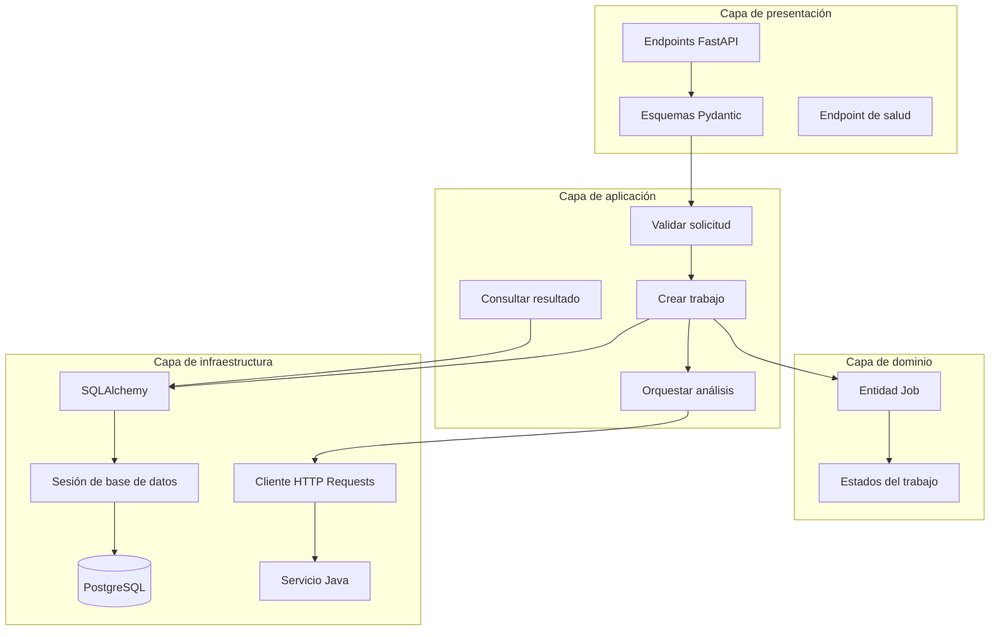

# Arquitectura interna del servicio Python

```mermaid
flowchart TB
    subgraph PRESENTACION["Capa de presentación"]
        ROUTES[Endpoints FastAPI]
        SCHEMAS[Esquemas Pydantic]
        HEALTH[Endpoint de salud]
    end

    subgraph APLICACION["Capa de aplicación"]
        CREATE[Crear trabajo]
        VALIDATE[Validar solicitud]
        ORCHESTRATE[Orquestar análisis]
        CONSULT[Consultar resultado]
    end

    subgraph DOMINIO["Capa de dominio"]
        JOB[Entidad Job]
        STATES[Estados del trabajo]
    end

    subgraph INFRAESTRUCTURA["Capa de infraestructura"]
        SQLA[SQLAlchemy]
        DBSESSION[Sesión de base de datos]
        HTTP[Cliente HTTP Requests]
        POSTGRES[(PostgreSQL)]
        JAVA[Servicio Java]
    end

    ROUTES --> SCHEMAS
    SCHEMAS --> VALIDATE
    VALIDATE --> CREATE
    CREATE --> JOB
    JOB --> STATES
    CREATE --> SQLA
    SQLA --> DBSESSION
    DBSESSION --> POSTGRES
    CREATE --> ORCHESTRATE
    ORCHESTRATE --> HTTP
    HTTP --> JAVA
    CONSULT --> SQLA
```