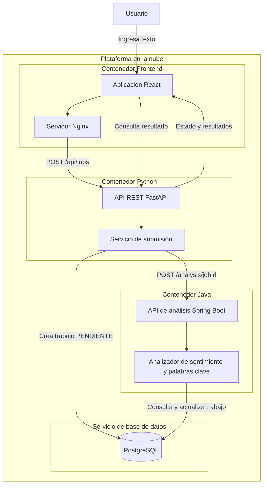

# Diagrama de componentes de AnalytiCore

```mermaid
flowchart TB
    U[Usuario]

    subgraph CLOUD[Plataforma en la nube]
        subgraph FRONT[Contenedor Frontend]
            REACT[Aplicación React]
            NGINX[Servidor Nginx]
        end

        subgraph PYTHON[Contenedor Python]
            API[API REST FastAPI]
            ORQ[Servicio de submisión]
        end

        subgraph JAVA[Contenedor Java]
            ANALYSIS[API de análisis Spring Boot]
            ENGINE[Analizador de sentimiento y palabras clave]
        end

        subgraph DATA[Servicio de base de datos]
            DB[(PostgreSQL)]
        end
    end

    U -->|Ingresa texto| REACT
    REACT --> NGINX
    NGINX -->|POST /api/jobs| API
    API --> ORQ
    ORQ -->|Crea trabajo PENDIENTE| DB
    ORQ -->|POST /analysis/jobId| ANALYSIS
    ANALYSIS --> ENGINE
    ENGINE -->|Consulta y actualiza trabajo| DB
    REACT -->|Consulta resultado| API
    API -->|Estado y resultados| REACT
```